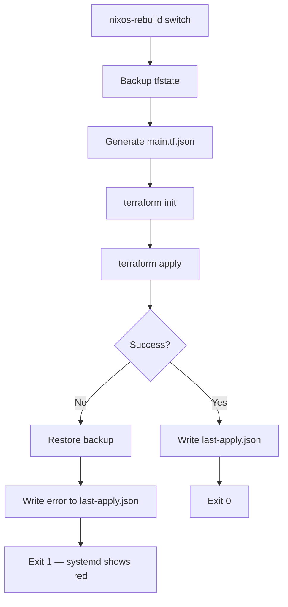

<picture>
  <source
    srcset="https://raw.githubusercontent.com/Cairnstew/tailscale-manager/main/assets/logo-dark.svg"
    media="(prefers-color-scheme: dark)"
  />
  
</picture>

# tailscale-manager

Declaratively manage your entire Tailscale tailnet via Terraform on NixOS.

A NixOS module + Python CLI that wraps the [Tailscale Terraform
provider](https://registry.terraform.io/providers/tailscale/tailscale)
to manage auth keys, DNS, tailnet settings, ACLs, and device discovery —
all packaged hermetically with [uv2nix](https://github.com/pyproject-nix/uv2nix).

```console
$ tailscale-manager status
Tailscale Manager — your-tailnet.ts.net
State dir: /var/lib/tailscale-manager

Last apply: 2026-05-31T00:00:00+00:00
  Result: ok

Terraform state: found
Managed keys: 1
  ✓ k123abc — managed key
     tags: tag:ci
```

## Features

- **Declarative key management** — one `nixos-rebuild switch` to create,
  update, or rotate auth keys. No imperative API calls.
- **Automatic rotation** — `recreate_if_invalid = "always"` means expired keys
  are replaced automatically on the next apply. No cron, no expiry tracking.
- **DNS management** — declarative nameservers, MagicDNS, and per-domain split
  DNS via `dns.nameservers`, `dns.magicDns`, `dns.splitNameservers`.
- **Tailnet settings** — configure device approval, auto-updates, key duration,
  HTTPS enforcement, and more via `tailnetSettings`.
- **ACL management** — opt-in full tailnet policy management with automatic
  backup of the current policy before every apply and restore on failure.
  Structured Nix options for grants, ACLs, SSH, tag owners, groups, hosts,
  IP sets, device postures, node attributes, auto-approvers, app connectors,
  and network options.
- **App connectors** — typed `policy.appConnectors` option that synthesizes
  the correct `nodeAttrs` entry with `tailscale.com/app-connectors` and
  merges it with existing node attributes.
- **Device discovery** — `tailscale-manager devices` CLI and a live device
  panel in the TUI, fed from Terraform state.
- **Failure-safe** — tfstate is backed up before every apply. On failure, the
  previous state is restored and the error is written to `last-apply.json`.
- **Credential watcher** — a systemd path unit re-runs apply when the OAuth
  secret file changes (e.g. after agenix rotation).
- **Read-only TUI** — optional Textual dashboard showing managed keys, devices,
  and system status. No write operations from the UI.
- **Monitoring-ready** — `tailscale-manager status --json` with exit code
  signaling for waybar, Prometheus node_exporter textfile collector, etc.
- **Hermetic builds** — full dependency tree locked via `uv.lock` and built
  by Nix. No `pip install` outside of Nix.

## Quick start

### 1. Add the flake

```nix
# flake.nix
{
  inputs = {
    nixpkgs.url = "github:NixOS/nixpkgs/nixos-unstable";
    tailscale-manager = {
      url = "github:Cairnstew/tailscale-manager";
      inputs.nixpkgs.follows = "nixpkgs";
    };
  };

  outputs = { self, nixpkgs, tailscale-manager, ... }: {
    nixosConfigurations.your-host = nixpkgs.lib.nixosSystem {
      modules = [
        tailscale-manager.nixosModules.default
        ./configuration.nix
      ];
    };
  };
}
```

### 2. Create an OAuth client

1. Go to [Tailscale admin console → Settings → OAuth clients](https://login.tailscale.com/admin/settings/oauth)
2. Click **Generate OAuth client**
3. Under **Scopes**, enable:
   - `auth_keys` — write access (required for key management)
   - `devices` — read access (required for device discovery)
   - `dns` — write access (required for DNS management)
   - `tailnet` — read + write access (required for tailnet settings and ACLs)
4. Under **Tag ownership**, add every tag you intend to pass via the
   `tags` option (e.g. `tag:server`, `tag:ci`). The OAuth client **must**
   own the tags it creates keys for — this is enforced by Tailscale and
   will cause apply to fail if misconfigured.
5. Save the **Client ID** and **Client Secret**
6. Store them in your secrets manager (agenix/sops) as:
   ```
   TAILSCALE_OAUTH_CLIENT_ID=<client-id>
   TAILSCALE_OAUTH_CLIENT_SECRET=<client-secret>
   ```

> **Important**: set `tailnet = "-"` in your module config to auto-resolve
> the tailnet from the OAuth credential. This is the recommended value.

### 3. Configure the module

```nix
# configuration.nix
{ config, ... }: {

  services.tailscale-manager = {
    enable = true;
    tailnet = "-";                              # auto-resolve from OAuth
    credentialsFile = "/run/secrets/tailscale-oauth";
    tags = [ "tag:ci" ];
  };
}
```

### 4. Deploy

```bash
nixos-rebuild switch
```

On first deploy, the service will:
1. Back up any existing tfstate (none on first run)
2. Generate `main.tf.json` 
3. Run `terraform init` (downloads the Tailscale provider)
4. Run `terraform apply` (creates the auth key)
5. Write the result to `last-apply.json`

Every subsequent `nixos-rebuild switch` repeats steps 1–5. If a key has
expired, `recreate_if_invalid = "always"` causes Terraform to delete it
and create a new one — **automatic rotation with zero custom logic.**

---

## NixOS module reference

All options under `services.tailscale-manager`.

| Option | Type | Default | Description |
|---|---|---|---|---|
| `enable` | `bool` | `false` | Enable the tailscale-manager service |
| `tailnet` | `string` | *(required)* | Tailnet name, e.g. `example.com`. Pass `"-"` to auto-resolve from the OAuth credential. |
| `credentialsFile` | `null or path` | `null` | *(required via assertion)* Path to an EnvironmentFile containing `TAILSCALE_OAUTH_CLIENT_ID` and `TAILSCALE_OAUTH_CLIENT_SECRET`. Encrypt with agenix or sops-nix. |
| `tags` | `list of strings` | `[]` | Tags to apply to the managed auth key (e.g. `["tag:ci"]`). All tags must start with `tag:`. The OAuth client must own these tags. |
| `stateDir` | `string` | `/var/lib/tailscale-manager` | Directory for Terraform state and backups |
| `package` | `package` | *(auto from flake)* | Package providing the CLI |
| `terraformBin` | `path` | `"${pkgs.terraform}/bin/terraform"` | Path to the Terraform binary |
| `backupCount` | `int` | `5` | Number of tfstate backups to retain in `stateDir/backups/` |
| `watchCredentials` | `bool` | `true` | Create a systemd path unit that re-runs apply when `credentialsFile` changes |
| `enableTimer` | `bool` | `false` | Enable a daily systemd timer to automatically re-run apply |
| `recreateIfInvalid` | `enum` | `"always"` | Whether to recreate the key if invalid (`"always"` or `"never"`) |
| `providerVersion` | `string` | `"~> 0.29"` | Tailscale Terraform provider version constraint |
| `dns.nameservers` | `list of strings` | `[]` | Global DNS nameserver IPs |
| `dns.magicDns` | `bool` | `false` | Enable MagicDNS |
| `dns.splitNameservers` | `attrs of list of strings` | `{}` | Per-domain split DNS (domain → nameserver IPs) |
| `tailnetSettings` | `null or submodule` | `null` | Declarative tailnet-wide settings (device approval, auto-updates, HTTPS, etc.) |
| `acl.enable` | `bool` | `false` | Enable ACL management (opt-in; backs up current policy before apply) |
| `acl.format` | `enum` | `"hujson"` | Policy format — `"hujson"` or `"json"` |
| `acl.policy` | `string` | `""` | Full ACL policy string (HuJSON or JSON) |

### Systemd units

Three units are created when enabled:

**`tailscale-manager.service`** — `Type=oneshot`, runs on every
`nixos-rebuild switch` (via `wantedBy = ["multi-user.target"]`):
1. Backs up `terraform.tfstate` to `backups/<timestamp>.tfstate`
2. Backs up current ACL policy if ACL management is enabled
3. Prunes old backups to `backupCount`
4. Generates `.tf.json` files (`main.tf.json`, `keys.tf.json`,
   `data.tf.json`, `dns.tf.json`, `settings.tf.json`, `acl.tf.json`)
5. Runs `terraform init`
6. Runs `terraform apply -auto-approve`
7. Writes result to `last-apply.json`
8. On failure: restores the most recent tfstate backup and ACL backup,
   writes error to `last-apply.json`, exits 1 (systemd shows red)

**`tailscale-manager-watch.path`** — if `watchCredentials = true`:
writes the file path changes. Re-triggers the service when
`credentialsFile` changes via atomic rename (e.g. agenix rotation).

**`tailscale-manager.timer`** — if `enableTimer = true`: runs the
service daily via `OnCalendar=daily` with `Persistent=true`. Useful
for catching drift or rotating keys near expiry.

### Activation script

After every `nixos-rebuild switch`, the system prints:
```
tailscale-manager: last apply [ok]
```
or:
```
tailscale-manager: last apply [error]
```
This is informational only — does not trigger re-apply.

---

## Home Manager module

For user-level CLI install without systemd service:

```nix
{ config, ... }: {

  homeManagerModules.tailscale-manager = {
    enable = true;
    tailnet = "-";
    credentialsFile = "/run/secrets/tailscale-oauth";
  };
}
```

Options: `enable`, `package`, `tailnet`, `credentialsFile`.

---

## Credential setup

> **Required OAuth scopes** depend on which features you use:
> - `auth_keys` — always required
> - `devices` — read access (required for device discovery)
> - `dns` — write access (required for DNS management)
> - `tailnet` — read + write access (required for tailnet settings and ACLs)
>
> Run `tailscale-manager init` after configuration to see preflight warnings
> about which scopes are needed.

The credentials file must be an EnvironmentFile (KEY=VAL format) containing:

```
TAILSCALE_OAUTH_CLIENT_ID=<your-client-id>
TAILSCALE_OAUTH_CLIENT_SECRET=<your-client-secret>
```

### With agenix

```nix
# secrets.nix
{
  "tailscale-oauth.age".publicKeys = [ <your-host-key> ];
}
```

```nix
# configuration.nix
age.secrets.tailscale-oauth = {
  file = ./secrets/tailscale-oauth.age;
};

services.tailscale-manager = {
  enable = true;
  tailnet = "-";
  credentialsFile = config.age.secrets.tailscale-oauth.path;
  tags = [ "tag:ci" ];
};
```

The path watcher automatically re-runs apply when agenix rotates the file.

### With sops-nix

```nix
sops.secrets.tailscale-oauth = {
  format = "dotenv";
  sopsFile = ./secrets/tailscale-oauth.env;
};

services.tailscale-manager = {
  enable = true;
  tailnet = "-";
  credentialsFile = config.sops.secrets.tailscale-oauth.path;
  tags = [ "tag:ci" ];
};
```

---

## CLI reference

```console
tailscale-manager init          # terraform init + provider download + preflight scope check
tailscale-manager plan          # terraform plan (shows pending changes)
tailscale-manager apply         # backup → generate → init → apply
tailscale-manager destroy       # backup → terraform destroy
tailscale-manager status        # read-only TUI dashboard
tailscale-manager status --json # JSON for scripting
tailscale-manager devices       # list discovered devices from tfstate
tailscale-manager devices --json # JSON device list for scripting
tailscale-manager backup-state  # manual tfstate backup
tailscale-manager restore-state # manual tfstate restore
tailscale-manager version       # show version
```

### Environment variables

| Variable | Required | Default | Description |
|---|---|---|---|---|
| `TAILSCALE_OAUTH_CLIENT_ID` | ✅ | — | Tailscale OAuth client ID |
| `TAILSCALE_OAUTH_CLIENT_SECRET` | ✅ | — | Tailscale OAuth client secret |
| `TAILSCALE_TAILNET` | ✅ | — | Tailnet name or `"-"` to auto-resolve |
| `TAILSCALE_MANAGER_STATE_DIR` | — | `/var/lib/tailscale-manager` | State and backup directory |
| `TAILSCALE_MANAGER_TERRAFORM_BIN` | — | `terraform` | Terraform binary path |
| `TAILSCALE_MANAGER_BACKUP_COUNT` | — | `5` | Number of backups to retain |
| `TAILSCALE_MANAGER_TAGS` | — | `""` | Comma-separated tags, e.g. `tag:ci,tag:infra` |
| `TAILSCALE_MANAGER_RECREATE_IF_INVALID` | — | `"always"` | Key rotation policy (`"always"` or `"never"`) |
| `TAILSCALE_MANAGER_PROVIDER_VERSION` | — | `"~> 0.29"` | Tailscale Terraform provider version constraint |
| `TAILSCALE_MANAGER_DNS_NAMESERVERS` | — | `""` | Comma-separated DNS nameserver IPs |
| `TAILSCALE_MANAGER_DNS_MAGIC_DNS` | — | `false` | Enable MagicDNS |
| `TAILSCALE_MANAGER_ACL_ENABLE` | — | `false` | Enable ACL management |
| `TAILSCALE_MANAGER_ACL_FORMAT` | — | `hujson` | ACL format (`hujson` or `json`) |
| `TAILSCALE_MANAGER_ACL_POLICY_PATH` | — | `""` | Path to a JSON file containing the full policy (used by NixOS module when structured policy is enabled) |

### Exit codes

| Command | Exit 0 | Exit 1 |
|---|---|---|
| `apply` | Key created/updated | Apply failed (error in `last-apply.json`) |
| `destroy` | Key destroyed | Destroy failed |
| `status --json` | Last result was `ok` | Last result was `error` |
| `plan` | No changes (or changes pending) | Plan failed |

Exit code 2 from `terraform plan -detailed-exitcode` (non-empty diff) is
treated as success — it means there are changes to apply, not an error.

### last-apply.json schema

Written to `stateDir/last-apply.json` after every apply:

```json
{
  "timestamp": "2026-05-31T00:00:00.000000+00:00",
  "result": "ok"
}
```

On failure:

```json
{
  "timestamp": "2026-05-31T00:00:00.000000+00:00",
  "result": "error",
  "error_message": "terraform apply ... failed (exit 1):\nError creating tailnet key: ..."
}
```

---

## Failure handling & recovery



Key guarantees:
- **Before every mutation**: tfstate is backed up to `backups/<timestamp>.tfstate`
- **Before ACL apply**: current ACL policy is backed up to
  `backups/acl-backup-<timestamp>.hujson`
- **On any failure**: the most recent tfstate and ACL backups are restored,
  leaving state and policy exactly as they were before the apply
- **Monitoring surface**: `last-apply.json` is the single source of truth for
  the last operation's result. The TUI, `status --json`, and activation script
  all read from it.
- **Systemd visibility**: non-zero exit code means `systemctl status
  tailscale-manager` shows red on failure. The error message is in the
  journal and `last-apply.json`.

---

## Key rotation strategy

This project does **not** implement custom key rotation logic. Instead, it
relies on a single Terraform attribute:

```json
"recreate_if_invalid": "always"
```

When a key expires, Terraform detects it as "invalid" and replaces it on the
next apply — deleting the old resource and creating a new one. This means:

- No cron jobs, no expiry date tracking, no manual intervention
- The rotation happens on the next `nixos-rebuild switch` or credential
  watcher trigger after expiry
- The key `id` changes (it's a new key), so any system that consumes the
  key value needs to re-read it from Terraform state or the Tailscale admin
  console

Key defaults: `reusable = true`, `ephemeral = false`, `preauthorized = true`,
`expiry` = 90 days (Tailscale default, configurable in the provider).

---

## TUI (optional)

Install with `uv add textual` or enable the `tui` extra, then run
`tailscale-manager status`.

```
┌───────────────────────┬──────────────────┬────────────────────────┐
│  Tailscale Manager — your-tailnet.ts.net│                        │
├───────────────────────┼──────────────────┤                        │
│ KEY STATUS            │ DEVICES          │  SYSTEM STATUS         │
│                       │                  │                        │
│ DataTable:            │ DataTable:       │  Last apply: 2026-...  │
│  ✓ k123 — ci          │  node1           │  Result: ✓ ok          │
│                       │  node2           │  Terraform state: found│
│                       │                  │  Credentials: found    │
│                       │                  │  Backups: 3 retained   │
│                       │                  │  Devices: 2 discovered │
│                       │                  │                        │
│                       │                  │  State dir: /var/lib/..│
│                       │                  │  Tailnet: your-tailnet │
└───────────────────────┴──────────────────┴────────────────────────┘
│  Q: Quit  R: Refresh  L: View Logs  D: Toggle Devices              │
└────────────────────────────────────────────────────────────────────┘
```

- **Left panel**: DataTable of managed auth keys from local tfstate
- **Center panel**: DataTable of discovered devices from `data.tailscale_devices`
- **Right panel**: System status (last apply, backups, credentials, device count)
- **Footer**: Q=Quit, R=Refresh (or auto-refresh every 30s), L=View Logs,
  D=Toggle devices panel
- **Read-only**: zero write operations from the UI

---

## Waybar / scripting integration

```json
{
  "custom/tailscale-manager": {
    "exec": "tailscale-manager status --json",
    "return-type": "json",
    "format": "{}"
  }
}
```

The `status --json` command exits 0 on success, 1 on failure, and outputs:

```json
{
  "last_apply": {
    "timestamp": "2026-05-31T00:00:00+00:00",
    "result": "ok"
  },
  "managed_keys": [
    {
      "id": "k123abc",
      "description": "ci runner key",
      "tags": ["tag:ci"],
      "revoked": false
    }
  ]
}
```

For Prometheus node_exporter textfile collector:

```bash
#!/bin/sh
# /etc/periodic/tailscale-manager-metrics
STATUS=$(tailscale-manager status --json 2>/dev/null) || STATUS='{"result":"error"}'
RESULT=$(echo "$STATUS" | jq -r '.last_apply.result // "unknown"')
COUNT=$(echo "$STATUS" | jq '.managed_keys | length')
cat > /var/lib/node_exporter/textfile/tailscale-manager.prom <<EOF
# HELP tailscale_manager_last_apply Last apply result (1=ok, 0=error)
# TYPE tailscale_manager_last_apply gauge
tailscale_manager_last_apply $([ "$RESULT" = "ok" ] && echo 1 || echo 0)
# HELP tailscale_manager_managed_keys Number of managed auth keys
# TYPE tailscale_manager_managed_keys gauge
tailscale_manager_managed_keys $COUNT
EOF
```

---

## Development

```bash
# Enter the dev environment
nix develop

# Fast environment (lint/typecheck only)
nix develop .#bootstrap

# Add a dependency
nix develop .#bootstrap
uv add <package>

# Lint
ruff check src/

# Type check
mypy src/tailscale_manager/

# Test
pytest tests/unit/ -v

# Build
nix build .#default

# Full check
nix flake check
```

See `CONTRIBUTING.md` for pull request workflow.

---

## Architecture

```
pyproject.toml  ──uv add/lock──►  uv.lock
                                      │
                                      ▼
flake.nix  ──workspace.mkPyprojectOverlay──►  Nix overlay
 │                                                 │
 │  pyproject-build-systems ───────────────────────┤
 │                                                 │
 └── composeManyExtensions ───────────────────────► pythonSet
                                                           │
                                               ┌───────────┼───────────────────┐
                                               ▼           ▼                   ▼
                                    nix/default.nix   nix/devshell.nix    nix/module.nix
                                    (mkApplication)   (mkShell)           (systemd service)
```

The project uses [uv2nix](https://github.com/pyproject-nix/uv2nix) to convert
`uv.lock` into Nix package derivations. The NixOS module provides the systemd
service, credential watcher, and activation hook. The Python CLI wraps the
`terraform` binary — the Tailscale provider does all the actual API work.

**Package layers** (import direction rules):

```
src/tailscale_manager/
├── core/           imports nothing from the package
├── models/         pure data shapes
├── services/       imports models/ and repositories/
│   └── features/   feature config builders (one per Terraform resource type)
├── repositories/   data access (tfstate I/O)
├── utils/          stateless pure functions
└── cli.py          Typer entrypoint (imports services/)
```

---

## Common issues

- **"tailnet-owned auth key must have tags set"** — the OAuth client needs
  tag ownership configured. See [OAuth tag
  ownership](https://tailscale.com/kb/1215/oauth-clients).
- **"requested tags are invalid or not permitted"** — same cause. Add the
  tags to the OAuth client's tag ownership list in the admin console.
- **Provider download fails on first run** — `terraform init` needs outbound
  internet to `registry.terraform.io`. See `GOTCHAS.md` for airgap workarounds.
- **`terraform` binary not found** — the module sets `terraformBin` to
  `${pkgs.terraform}/bin/terraform` by default. When running the CLI outside
  the NixOS service, ensure terraform is in PATH or set
  `TAILSCALE_MANAGER_TERRAFORM_BIN`.

For a full list of gotchas, see [`GOTCHAS.md`](./GOTCHAS.md).

---

## Reference documentation

In-repo reference docs covering Tailscale concepts, syntax, and API:

- [`docs/POLICY.md`](./docs/POLICY.md) — Tailnet policy file syntax (grants, ACLs, SSH, tag ownership)
- [`docs/OAUTH.md`](./docs/OAUTH.md) — OAuth clients & trust credentials
- [`docs/API.md`](./docs/API.md) — Tailscale API endpoints, scopes, and Terraform mapping
- [`docs/CONCEPTS.md`](./docs/CONCEPTS.md) — Terminology and concepts

## Related resources

- [Tailscale Terraform provider docs](https://registry.terraform.io/providers/tailscale/tailscale)
- [Tailscale OAuth client docs](https://tailscale.com/kb/1215/oauth-clients)
- [Tailscale Terraform provider source](https://github.com/tailscale/terraform-provider-tailscale)
- [uv2nix docs](https://pyproject-nix.github.io/uv2nix/)
