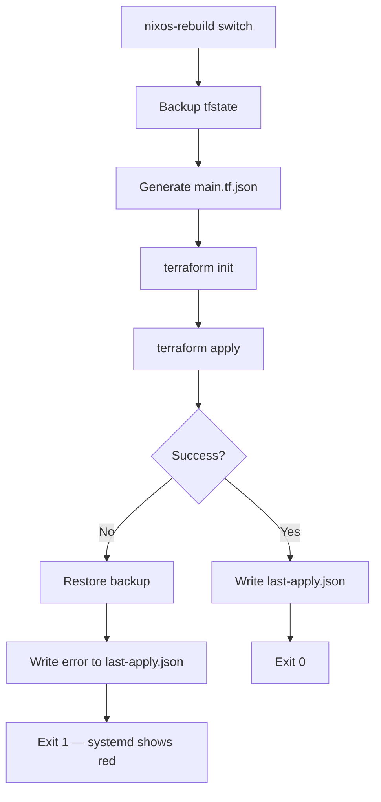

<picture>
  <source
    srcset="https://raw.githubusercontent.com/Cairnstew/tailscale-manager/main/assets/logo-dark.svg"
    media="(prefers-color-scheme: dark)"
  />
  
</picture>

# tailscale-manager

Declaratively manage Tailscale auth keys via Terraform on NixOS.

A NixOS module + Python CLI that wraps the [Tailscale Terraform
provider](https://registry.terraform.io/providers/tailscale/tailscale)
to create, rotate, and expire auth keys — all packaged hermetically with
[uv2nix](https://github.com/pyproject-nix/uv2nix).

```console
$ tailscale-manager status
Tailscale Manager — your-tailnet.ts.net
State dir: /var/lib/tailscale-manager

Last apply: 2026-05-31T00:00:00+00:00
  Result: ok

Terraform state: found
Managed keys: 1
  ✓ k123abc — managed key
     tags: tag:ci
```

## Features

- **Declarative key management** — one `nixos-rebuild switch` to create,
  update, or rotate auth keys. No imperative API calls.
- **Automatic rotation** — `recreate_if_invalid = "always"` means expired keys
  are replaced automatically on the next apply. No cron, no expiry tracking.
- **Failure-safe** — tfstate is backed up before every apply. On failure, the
  previous state is restored and the error is written to `last-apply.json`.
- **Credential watcher** — a systemd path unit re-runs apply when the OAuth
  secret file changes (e.g. after agenix rotation).
- **Read-only TUI** — optional Textual dashboard showing managed keys and
  system status. No write operations from the UI.
- **Monitoring-ready** — `tailscale-manager status --json` with exit code
  signaling for waybar, Prometheus node_exporter textfile collector, etc.
- **Hermetic builds** — full dependency tree locked via `uv.lock` and built
  by Nix. No `pip install` outside of Nix.

## Quick start

### 1. Add the flake

```nix
# flake.nix
{
  inputs = {
    nixpkgs.url = "github:NixOS/nixpkgs/nixos-unstable";
    tailscale-manager = {
      url = "github:Cairnstew/tailscale-manager";
      inputs.nixpkgs.follows = "nixpkgs";
    };
  };

  outputs = { self, nixpkgs, tailscale-manager, ... }: {
    nixosConfigurations.your-host = nixpkgs.lib.nixosSystem {
      modules = [
        tailscale-manager.nixosModules.default
        ./configuration.nix
      ];
    };
  };
}
```

### 2. Create an OAuth client

1. Go to https://login.tailscale.com/admin/settings/oauth
2. Create a client with **all** (read + write) scopes
3. Under **Tag ownership**, add the tags this client can create keys with
   (e.g. `tag:ci`, `tag:infra`)
4. Save the client ID and secret

### 3. Configure the module

```nix
# configuration.nix
{ config, ... }: {

  services.tailscale-manager = {
    enable = true;
    tailnet = "-";                              # auto-resolve from OAuth
    credentialsFile = "/run/secrets/tailscale-oauth";
    tags = [ "tag:ci" ];
  };
}
```

### 4. Deploy

```bash
nixos-rebuild switch
```

On first deploy, the service will:
1. Back up any existing tfstate (none on first run)
2. Generate `main.tf.json` 
3. Run `terraform init` (downloads the Tailscale provider)
4. Run `terraform apply` (creates the auth key)
5. Write the result to `last-apply.json`

Every subsequent `nixos-rebuild switch` repeats steps 1–5. If a key has
expired, `recreate_if_invalid = "always"` causes Terraform to delete it
and create a new one — **automatic rotation with zero custom logic.**

---

## NixOS module reference

All options under `services.tailscale-manager`.

| Option | Type | Default | Description |
|---|---|---|---|
| `enable` | `bool` | `false` | Enable the tailscale-manager service |
| `tailnet` | `string` | *(required)* | Tailnet name, e.g. `example.com`. Pass `"-"` to auto-resolve from the OAuth credential. |
| `credentialsFile` | `path` | *(required)* | Path to an EnvironmentFile containing `TAILSCALE_OAUTH_CLIENT_ID` and `TAILSCALE_OAUTH_CLIENT_SECRET`. Encrypt with agenix or sops-nix. |
| `tags` | `list of strings` | `[]` | Tags to apply to the managed auth key (e.g. `["tag:ci"]`). The OAuth client must own these tags. |
| `stateDir` | `string` | `/var/lib/tailscale-manager` | Directory for Terraform state and backups |
| `package` | `package` | `pkgs.tailscale-manager` | Package providing the CLI |
| `terraformBin` | `path` | `"${pkgs.terraform}/bin/terraform"` | Path to the Terraform binary |
| `backupCount` | `int` | `5` | Number of tfstate backups to retain in `stateDir/backups/` |
| `watchCredentials` | `bool` | `true` | Create a systemd path unit that re-runs apply when `credentialsFile` changes |

### Systemd units

Three units are created when enabled:

**`tailscale-manager.service`** — `Type=oneshot`, runs on every
`nixos-rebuild switch` (via `wantedBy = ["multi-user.target"]`):
1. Backs up `terraform.tfstate` to `backups/<timestamp>.tfstate`
2. Prunes old backups to `backupCount`
3. Generates `main.tf.json`
4. Runs `terraform init`
5. Runs `terraform apply -auto-approve`
6. Writes result to `last-apply.json`
7. On failure: restores the most recent backup, writes error to
   `last-apply.json`, exits 1 (systemd shows red)

**`tailscale-manager-watch.path`** — if `watchCredentials = true`:
writes the file path changes. Re-triggers the service when
`credentialsFile` changes via atomic rename (e.g. agenix rotation).

**`tailscale-manager.timer`** — placeholder (commented out). Uncomment
and configure `OnCalendar` for periodic apply if desired.

### Activation script

After every `nixos-rebuild switch`, the system prints:
```
tailscale-manager: last apply [ok]
```
or:
```
tailscale-manager: last apply [error]
```
This is informational only — does not trigger re-apply.

---

## Home Manager module

For user-level CLI install without systemd service:

```nix
{ config, ... }: {

  homeManagerModules.tailscale-manager = {
    enable = true;
    tailnet = "-";
    credentialsFile = "/run/secrets/tailscale-oauth";
  };
}
```

Options: `enable`, `package`, `tailnet`, `credentialsFile`.

---

## Credential setup

The credentials file must be an EnvironmentFile (KEY=VAL format) containing:

```
TAILSCALE_OAUTH_CLIENT_ID=<your-client-id>
TAILSCALE_OAUTH_CLIENT_SECRET=<your-client-secret>
```

### With agenix

```nix
# secrets.nix
{
  "tailscale-oauth.age".publicKeys = [ <your-host-key> ];
}
```

```nix
# configuration.nix
age.secrets.tailscale-oauth = {
  file = ./secrets/tailscale-oauth.age;
};

services.tailscale-manager = {
  enable = true;
  tailnet = "-";
  credentialsFile = config.age.secrets.tailscale-oauth.path;
  tags = [ "tag:ci" ];
};
```

The path watcher automatically re-runs apply when agenix rotates the file.

### With sops-nix

```nix
sops.secrets.tailscale-oauth = {
  format = "dotenv";
  sopsFile = ./secrets/tailscale-oauth.env;
};

services.tailscale-manager = {
  enable = true;
  tailnet = "-";
  credentialsFile = config.sops.secrets.tailscale-oauth.path;
  tags = [ "tag:ci" ];
};
```

---

## CLI reference

```console
tailscale-manager init          # terraform init + provider download
tailscale-manager plan          # terraform plan (shows pending changes)
tailscale-manager apply         # backup → generate → init → apply
tailscale-manager destroy       # backup → terraform destroy
tailscale-manager status        # read-only TUI dashboard
tailscale-manager status --json # JSON for scripting
tailscale-manager backup-state  # manual tfstate backup
tailscale-manager restore-state # manual tfstate restore
tailscale-manager version       # show version
```

### Environment variables

| Variable | Required | Default | Description |
|---|---|---|---|
| `TAILSCALE_OAUTH_CLIENT_ID` | ✅ | — | Tailscale OAuth client ID |
| `TAILSCALE_OAUTH_CLIENT_SECRET` | ✅ | — | Tailscale OAuth client secret |
| `TAILSCALE_TAILNET` | ✅ | — | Tailnet name or `"-"` to auto-resolve |
| `TAILSCALE_MANAGER_STATE_DIR` | — | `/var/lib/tailscale-manager` | State and backup directory |
| `TAILSCALE_MANAGER_TERRAFORM_BIN` | — | `terraform` | Terraform binary path |
| `TAILSCALE_MANAGER_BACKUP_COUNT` | — | `5` | Number of backups to retain |
| `TAILSCALE_MANAGER_TAGS` | — | `""` | Comma-separated tags, e.g. `tag:ci,tag:infra` |

### Exit codes

| Command | Exit 0 | Exit 1 |
|---|---|---|
| `apply` | Key created/updated | Apply failed (error in `last-apply.json`) |
| `destroy` | Key destroyed | Destroy failed |
| `status --json` | Last result was `ok` | Last result was `error` |
| `plan` | No changes (or changes pending) | Plan failed |

Exit code 2 from `terraform plan -detailed-exitcode` (non-empty diff) is
treated as success — it means there are changes to apply, not an error.

### last-apply.json schema

Written to `stateDir/last-apply.json` after every apply:

```json
{
  "timestamp": "2026-05-31T00:00:00.000000+00:00",
  "result": "ok"
}
```

On failure:

```json
{
  "timestamp": "2026-05-31T00:00:00.000000+00:00",
  "result": "error",
  "error_message": "terraform apply ... failed (exit 1):\nError creating tailnet key: ..."
}
```

---

## Failure handling & recovery



Key guarantees:
- **Before every mutation**: tfstate is backed up to `backups/<timestamp>.tfstate`
- **On any failure**: the most recent backup is restored, leaving state exactly
  as it was before the apply
- **Monitoring surface**: `last-apply.json` is the single source of truth for
  the last operation's result. The TUI, `status --json`, and activation script
  all read from it.
- **Systemd visibility**: non-zero exit code means `systemctl status
  tailscale-manager` shows red on failure. The error message is in the
  journal and `last-apply.json`.

---

## Key rotation strategy

This project does **not** implement custom key rotation logic. Instead, it
relies on a single Terraform attribute:

```json
"recreate_if_invalid": "always"
```

When a key expires, Terraform detects it as "invalid" and replaces it on the
next apply — deleting the old resource and creating a new one. This means:

- No cron jobs, no expiry date tracking, no manual intervention
- The rotation happens on the next `nixos-rebuild switch` or credential
  watcher trigger after expiry
- The key `id` changes (it's a new key), so any system that consumes the
  key value needs to re-read it from Terraform state or the Tailscale admin
  console

Key defaults: `reusable = true`, `ephemeral = false`, `preauthorized = true`,
`expiry` = 90 days (Tailscale default, configurable in the provider).

---

## TUI (optional)

Install with `uv add textual` or enable the `tui` extra, then run
`tailscale-manager status`.

```
┌─────────────────────────────────────────┐
│  Tailscale Manager — your-tailnet.ts.net│
├────────────────┬────────────────────────┤
│ KEY STATUS     │  SYSTEM STATUS         │
│                │                        │
│ DataTable:     │  Last apply: 2026-...  │
│  ✓ k123 — ci  │  Result: ✓ ok          │
│                │  Terraform state: found│
│                │  Credentials: found    │
│                │  Backups: 3 retained   │
│                │                        │
│                │  State dir: /var/lib/..│
│                │  Tailnet: your-tailnet │
└────────────────┴────────────────────────┘
│  Q: Quit  R: Refresh  L: View Logs      │
└─────────────────────────────────────────┘
```

- **Left panel**: DataTable of managed auth keys from local tfstate
- **Right panel**: System status (last apply, backups, credentials)
- **Footer**: Q=Quit, R=Refresh (or auto-refresh every 30s), L=View Logs
  (tails `journalctl -u tailscale-manager.service`)
- **Read-only**: zero write operations from the UI

---

## Waybar / scripting integration

```json
{
  "custom/tailscale-manager": {
    "exec": "tailscale-manager status --json",
    "return-type": "json",
    "format": "{}"
  }
}
```

The `status --json` command exits 0 on success, 1 on failure, and outputs:

```json
{
  "last_apply": {
    "timestamp": "2026-05-31T00:00:00+00:00",
    "result": "ok"
  },
  "managed_keys": [
    {
      "id": "k123abc",
      "description": "ci runner key",
      "tags": ["tag:ci"],
      "revoked": false
    }
  ]
}
```

For Prometheus node_exporter textfile collector:

```bash
#!/bin/sh
# /etc/periodic/tailscale-manager-metrics
STATUS=$(tailscale-manager status --json 2>/dev/null) || STATUS='{"result":"error"}'
RESULT=$(echo "$STATUS" | jq -r '.last_apply.result // "unknown"')
COUNT=$(echo "$STATUS" | jq '.managed_keys | length')
cat > /var/lib/node_exporter/textfile/tailscale-manager.prom <<EOF
# HELP tailscale_manager_last_apply Last apply result (1=ok, 0=error)
# TYPE tailscale_manager_last_apply gauge
tailscale_manager_last_apply $([ "$RESULT" = "ok" ] && echo 1 || echo 0)
# HELP tailscale_manager_managed_keys Number of managed auth keys
# TYPE tailscale_manager_managed_keys gauge
tailscale_manager_managed_keys $COUNT
EOF
```

---

## Development

```bash
# Enter the dev environment
nix develop

# Fast environment (lint/typecheck only)
nix develop .#bootstrap

# Add a dependency
nix develop .#bootstrap
uv add <package>

# Lint
ruff check src/

# Type check
mypy src/tailscale_manager/

# Test
pytest tests/unit/ -v

# Build
nix build .#default

# Full check
nix flake check
```

See `CONTRIBUTING.md` for pull request workflow.

---

## Architecture

```
pyproject.toml  ──uv add/lock──►  uv.lock
                                      │
                                      ▼
flake.nix  ──workspace.mkPyprojectOverlay──►  Nix overlay
 │                                                 │
 │  pyproject-build-systems ───────────────────────┤
 │                                                 │
 └── composeManyExtensions ───────────────────────► pythonSet
                                                           │
                                               ┌───────────┼───────────────────┐
                                               ▼           ▼                   ▼
                                    nix/default.nix   nix/devshell.nix    nix/module.nix
                                    (mkApplication)   (mkShell)           (systemd service)
```

The project uses [uv2nix](https://github.com/pyproject-nix/uv2nix) to convert
`uv.lock` into Nix package derivations. The NixOS module provides the systemd
service, credential watcher, and activation hook. The Python CLI wraps the
`terraform` binary — the Tailscale provider does all the actual API work.

**Package layers** (import direction rules):

```
src/tailscale_manager/
├── core/           imports nothing from the package
├── models/         pure data shapes
├── services/       imports models/ and repositories/
├── repositories/   data access (tfstate I/O)
├── utils/          stateless pure functions
└── cli.py          Typer entrypoint (imports services/)
```

---

## Common issues

- **"tailnet-owned auth key must have tags set"** — the OAuth client needs
  tag ownership configured. See [OAuth tag
  ownership](https://tailscale.com/kb/1215/oauth-clients).
- **"requested tags are invalid or not permitted"** — same cause. Add the
  tags to the OAuth client's tag ownership list in the admin console.
- **Provider download fails on first run** — `terraform init` needs outbound
  internet to `registry.terraform.io`. See `GOTCHAS.md` for airgap workarounds.
- **`terraform` binary not found** — the module sets `terraformBin` to
  `${pkgs.terraform}/bin/terraform` by default. When running the CLI outside
  the NixOS service, ensure terraform is in PATH or set
  `TAILSCALE_MANAGER_TERRAFORM_BIN`.

For a full list of gotchas, see [`GOTCHAS.md`](./GOTCHAS.md).

---

## Related resources

- [Tailscale Terraform provider docs](https://registry.terraform.io/providers/tailscale/tailscale)
- [Tailscale OAuth client docs](https://tailscale.com/kb/1215/oauth-clients)
- [Tailscale Terraform provider source](https://github.com/tailscale/terraform-provider-tailscale)
- [uv2nix docs](https://pyproject-nix.github.io/uv2nix/)
